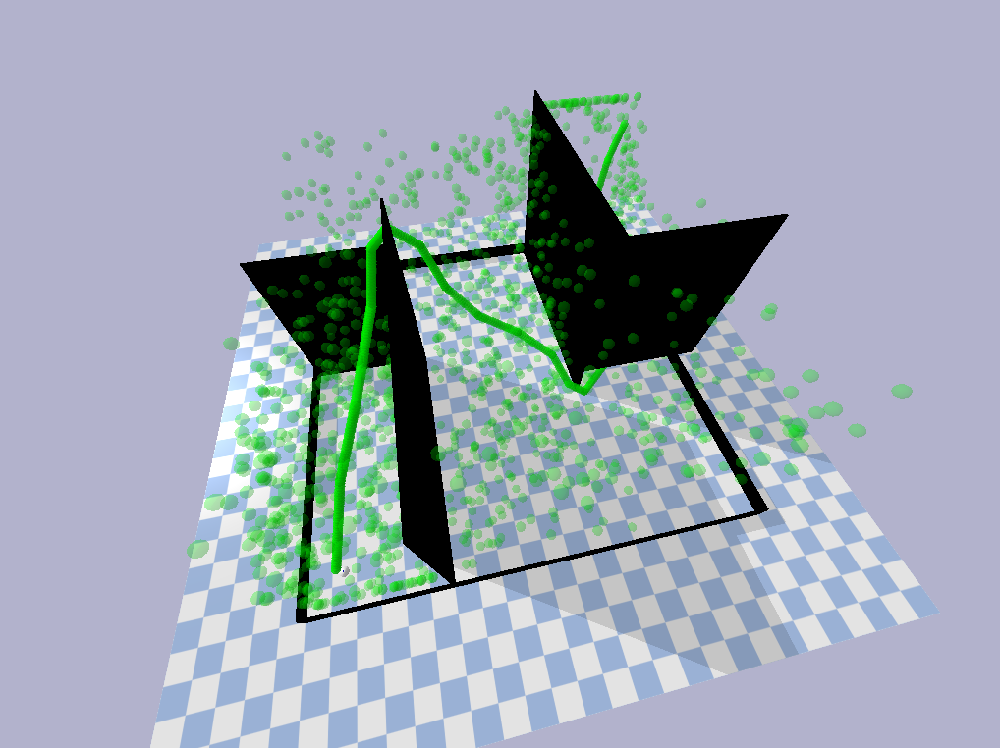
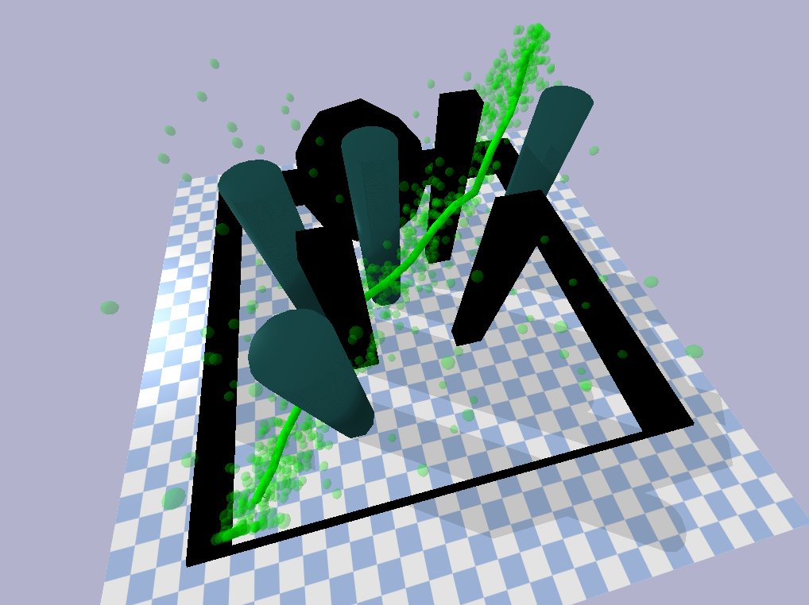
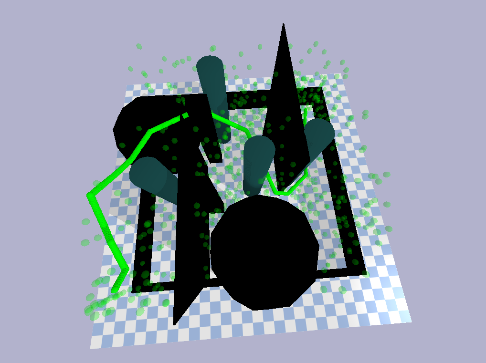
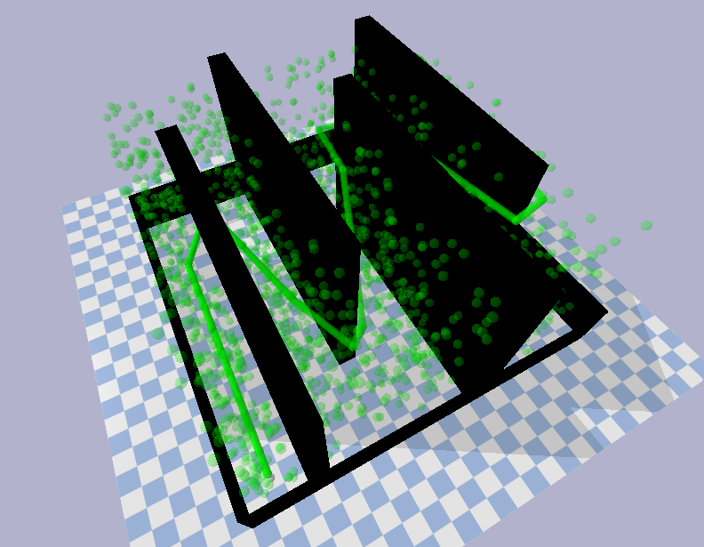

# PDM drone
This is the repository for the final project of the course RO47005 Planning and Decision Making at TU Delft. We have implemented an entirely self-written version of the Informed RRT* algorithm in 3D. Together with this we have created multiple worlds with different obstacles to test the algorithm in.

### How to run?
1. First clone this repository
2. Make sure to have the `urdfenvs` package installed (see [here](https://pypi.org/project/urdfenvs/))
3. Install additional packages if not yet installed, such as numpy, pickle and datetime
4. Run the `main.py` file in the `planner` folder, this file includes multiple parameters that can be changed to change the environment and the algorithm
5. The final path will be plotted in a 3D plot and saved in a `.pkl` file in the `final_paths` folder

### Parameters
- `motion_planing_algorithm`, choose which algorithm to use, the options are "rrt_star" and "informed_rrt_star"
- `obstacle_env`, choose which environment to use, the options are "standard", "simple", "complex" and "maze"
- `radius`, set a radius for the drone
- `draw_final_path`, choose whether to draw the final path or not (True or False)
- `draw_every_node`, choose whether to draw every accepted node or not (True or False)
- `iterations`, choose the minimum number of iterations before it can terminate
- `min_distance`, choose the minimum distance between the goal and the final node before it can terminate

## Showcase
### Environment: "standard"

path length after 2200 iterations: 45.240

### Environment: "simple"

path length after 1000 iterations: 26.431

### Environment: "complex"

path length after 1260 iterations: 42.089

### Environment: "maze"

path length after 2070 iterations: 74.76

## Issues
Currently the algorithm tends to crash when low values for the sampling are used (in the `is_collision_free` function). This is why the sampling rate is quite high, but that leads to long run times. A future version of this algorithm should be able to handle lower sampling rates.
